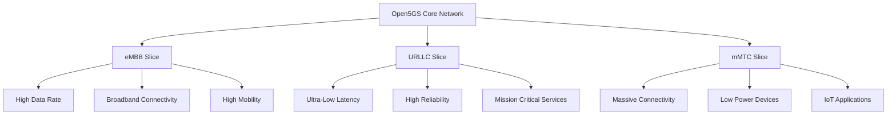

 
## Table of Contents
 
1. [Open5gs Installation](#01-open5gs-installation)
2. [UNIRANSIM](#02-uniransim-installation)
3. [Setup Static IP Address](#03-setup-static-ip-address).
4. [Configuration Changes for UERANSIM and Open5GS Integration for User registration](#04-configuration-changes)
5. [UE Activation](#05-commands-for-register)
6. [GNB Activation](#06-gnb-activation)
8. [open5gs Activation](#07-open5gs-activation)
9. [Setup User Data](#09-setup-user-data)
10. [Open5GS Core Network Slices](#10-Open5GS-Core-Network-Slices)
11. [Slice Planning](#11-slice-planning)
12. [Installation of SIP Client Server Asterisk,Kamailio and FreePBX](#12-installation-of-sip-client-server-asterisk-kamilio-and-freepbx)
 
## 01.   Open5gs instalation
[Refer this md file for Open5gs Installation ](https://github.com/FRA-UAS/mobcomwise23-24-team_5gtechtribe/blob/main/Documentions/Project_Documentation/Ueransim%20%26%20Open5gs%20Installation/02%20Open5GS.md)

<a id="01-open5gs-installation"></a>
 
## 02.  UNIRANSIM instalation
[Refer this md file for UNIRANSIM Installation](https://github.com/FRA-UAS/mobcomwise23-24-team_5gtechtribe/blob/main/Documentions/Project_Documentation/Ueransim%20%26%20Open5gs%20Installation/01%20UERANSIM.md)

<a id="02-uniransim-installation">
 
## 03 Setting up a Static IP Address for mybridge on Ubuntu
 
File Modified : `/etc/netplan/01-netcfg.yaml`
 
### 3.1 Access the Netplan Configuration File
Navigated to the Netplan configuration directory `/etc/netplan/` to modify the network settings.
### 3.2 Edit the Configuration File
Opened the `01-netcfg.yaml` file using a text editor with superuser privileges. This was done using the command:
```csharp
sudo nano /etc/netplan/01-netcfg.yaml
```
### 3.3 Configure the mybridge Interface
Modified the configuration for the mybridge network interface. The changes made were as follows:
 
- Specified mybridge to use the network interface `enp0s1`.
- Disabled DHCP (`dhcp4: no`) to enable static IP configuration.
- Set the static IP address to `192.168.64.2` with a subnet mask of `24` (equivalent to `255.255.255.0`).
- Defined a default route (`0.0.0.0/0`) with a gateway of `192.168.64.1.`
- Specified DNS servers with the IP addresses `8.8.8.8` and `8.8.4.4`.
 
The resulting configuration block for mybridge looked like this:
 ```csharp
# /etc/netplan/01-netcfg.yaml

network:
  version: 2
  renderer: networkd
  bridges:
    mybridge:
      interfaces: [enp0s1]
      dhcp4: no
      addresses: [192.168.64.2/24]
      routes:
        - to: 0.0.0.0/0
          via: 192.168.64.1
      nameservers:
        addresses: [8.8.8.8, 8.8.4.4]

```
 
### 3.4 Apply the Configuration Changes
Saved the changes in the editor and exited. Applied the new network configuration by running the command:
```csharp
sudo netplan apply
```
### 3.5 Verification
Verified the new static IP configuration using the `ifconfig` command, which showed mybridge now had the IP address `192.168.64.2`.
 ```csharp
user@user: $ ifconfig


mybridge: flags=4163<UP,BROADCAST,RUNNING,MULTICAST>  mtu 1500
        inet 192.168.64.2  netmask 255.255.255.0  broadcast 192.168.64.255
        inet6 fe80::349d:f9ff:fe41:1032  prefixlen 64  scopeid 0x20<link>
        inet6 fd4a:8f41:e977:76ca:349d:f9ff:fe41:1032  prefixlen 64  scopeid 0x0<global>
        ether 36:9d:f9:41:10:32  txqueuelen 1000  (Ethernet)
        RX packets 5763  bytes 72490632 (72.4 MB)
        RX errors 0  dropped 0  overruns 0  frame 0
        TX packets 3567  bytes 338928 (338.9 KB)
        TX errors 0  dropped 0 overruns 0  carrier 0  collisions 0
```
 
<a id="02-uniransim-installation"> 
 
## 04. 	Configuration Changes for UERANSIM and Open5GS Integration for User registration
We are registering user data into the User Data Management (UDM) system for testing purposes, employing two virtual machines in our setup.

The configuration changes is to ensure robust IP connectivity and effective signaling between the UERANSIM (UE RAN Simulator) and various components of the Open5GS architecture.
### 4.1 Environment Setup
**UERANSIM Virtual Machine IP**: `192.168.64.2`.

**Open5GS Virtual Machine IP**: `192.168.64.3`
### 4.2 Configuration Changes
#### 4.2.1 UERANSIM Configuration (open5gs-ue.yaml):
- Modified the `gnbsearchlist` IP address to `192.168.64.2`.
- Ensures UERANSIM accurately locates the gNodeB using the specified IP address.
#### 4.2.2 Open5GS gNodeB Configuration (open5gsgnb-gnb.yaml):
- Adjusted linkIP to `192.168.64.2`.
- Set ngapIP to `192.168.64.2`.
- Configured `ngap` port number to `38412`.
- Altered GTP IP (GTPIP) to 192.168.64.2.

This Ensures the `gNodeB` component in the Open5GS suite interfaces correctly with UERANSIM on the specified IP address and ports, facilitating NGAP and GTP communications.
#### 4.2.3 Open5GS AMF Configuration:
- Updated the AMF IP address to `192.168.64.3`.
- Set the AMF port number to `38412`.
Crucial for establishing the control plane connection between the UE (simulated by UERANSIM) and the 5G Core network (Open5GS).

<a id="02-uniransim-installation">
 
## 05.   UE Activation
This section of the README outlines the procedure for establishing a PDU (Packet Data Unit) session, focusing particularly on the activation of User Equipment (UE):
### 5.1 Prerequisites
Before proceeding, ensure you have the following set up:
- A functioning 5G Core Network (5GC) environment.
- UERANSIM or a similar tool for simulating UE and gNodeB.
- List of gNB IP addresses for Radio Link Simulation (Change the below ip address as per your system ip address).
gnbSearchList:
  - 192.168.64.2
### 5.2 Steps for UE Activation
1. Starting the UE
To initiate the UE, run the following command:
```csharp
sudo build/nr-ue -c config/open5gs-ue.yaml
```
or
```csharp
nr-ue -c ue.yaml
```
2. Establishing the Connection
Once the UE starts, it will attempt to connect to the 5G Core Network. Monitor the logs to verify that the initial connection is established.

3. Initiate PDU Session
After the UE is successfully connected, initiate the PDU session with the following command:

```csharp
// Replace <session_id> with your session identifier
establish-pdu-session <session_id>
```
This command triggers the PDU session establishment process in the network.

4. Monitoring the Session
Monitor the session establishment logs to ensure that the PDU session is successfully created. Look for confirmation messages indicating successful session establishment.
[PDU Capture](https://github.com/FRA-UAS/mobcomwise23-24-team_5gtechtribe/blob/main/Project%20Setup/Results/PDU%20capture%20at%20UE.png)

5. Troubleshooting
In case of issues, check the following:
-Ensure that the UE's configuration aligns with the network settings.
-Verify that the 5G Core Network is operational and accessible.
-Review logs for error messages or warnings.

<a id="02-uniransim-installation">

## 06.  GNB Activation

 ### 6.1 Prerequisites 
 - Open5GS (latest version)
 - UERANSIM (latest version)
 - A suitable Linux distribution (e.g., Ubuntu 20.04)

 ### 6.2 Configuration (GNB Configuration in UERANSIM)
 To ensure proper communication between the GNB and the core network components in Open5GS, certain configuration changes are necessary in UERANSIM. This section details the modifications needed for the link IP, NGA VIP, GTP IP, and AMF configuration.

 ### 6.3 Configuring Link IP, NGA VIP, and GTP IP
The configuration file for UERANSIM's GNB (typically named gnb.yaml) needs to be edited to set up the correct IP addresses for the link, NGA, and GTP. Here's how you can do it:

1. Link IP (Interface IP): This is the IP address used by the GNB for the N2 interface.
   - Locate the linkIp parameter in gnb.yaml and set it to the desired IP address.
```csharp
linkIp: <your-link-ip-address (Your system IP Address)>
```

2. NGA VIP (Network Gateway Address VIP): This IP is used for the N3 interface towards the UPF.

- Find the `ngapIp` parameter and update it.
```csharp
ngapIp: <your-nga-vip-address (Your system IP Address)>
```

3. GTP IP: The IP address used for GTP-U (User Plane) communication.

- Modify the gtpIp parameter accordingly.
```csharp
gtpIp: <your-gtp-ip-address (Your system IP Address)>
```
### 6.4 Configuring AMF
To ensure the GNB correctly interfaces with the AMF component in Open5GS, you need to configure the AMF information in the GNB configuration file.

- Open the gnb.yaml file in UERANSIM.
- Locate the section for AMF configurations.
- Update the amfConfigs parameter with the correct AMF IP and other relevant details as required by your network setup.
```csharp
amfConfigs:
  - address: <amf-ip-address>
    port: <amf-port>
```
### 6.5 Activation of GNB
After making these changes, save the file and restart your GNB in UERANSIM for the changes to take effectively and then run the below command:
```csharp
./run_gnb.sh 
```
or 

```csharp
sudo build/nr-gnb -c config/open5gs-gnb.yaml
```
<a id="06-gnb-activation">

## 07. Open5gs Activation
 To activate open5gs use: 
 Locate the open5gs directory
 ``` csharp
    cd open5gs/
```
and to activate 

```diff
./install/bin/open5gs-nrfd & ./install/bin/open5gs-scpd & ./install/bin/open5gs-amfd & ./install/bin/open5gs-smfd &./install/bin/open5gs-upfd & ./install/bin/open5gs-ausfd & ./install/bin/open5gs-udmd & ./install/bin/open5gs-pcfd & ./install/bin/open5gs-nssfd & ./install/bin/open5gs-bsfd & ./install/bin/open5gs-udrd & ./install/bin/open5gs-mmed & ./install/bin/open5gs-sgwcd & ./install/bin/open5gs-sgwud & ./install/bin/open5gs-hssd & ./install/bin/open5gs-pcrfd

```
To stop open5gs use
``` diff
pkill -f './install/bin/open5gs-'

```
<a id="07-open5gs-activation">
 
## 08.  Open5gs MongoDB 
Open5GS uses MongoDB as the database for the HSS and PCRF. This database contains all our SDM data, like our SIM Keys, Subscriber profiles, PCC Rules, etc.
#### 8.1 Open5GSAMongoDB Installations:
-  Install the MongoDB dependecy packages
```csharp
# apt update
# apt install wget gnupg software-properties-common ca-certificates lsb-release
# wget -qO - https://www.mongodb.org/static/pgp/server-6.0.asc | gpg --dearmor -o /etc/apt/trusted.gpg.d/mongodb-6.gpg
# echo "deb [ arch=amd64,arm64 ] https://repo.mongodb.org/apt/ubuntu $(lsb_release -cs)/mongodb-org/6.0 multiverse" | tee /etc/apt/sources.list.d/mongodb-org-6.0.list
```
- Install MongoDB
```csharp
# apt update
# apt install -y mongodb-org
```
- Verify the Installation:
```csharp
# systemctl enable mongod
# systemctl start mongod
```

<a id="02-uniransim-installation">

## 09.   Setup User Data


## 10. Open5GS Core Network Slices

This data provides an overview of the different network slices in the Open5GS core, specifically focusing on eMBB, URLLC, and mMTC slices. These slices are part of the 5G network to cater to different types of services and requirements.

## Network Slicing in 5G

Network slicing is a key feature of the 5G architecture, allowing the physical network to be divided into multiple virtual networks, each optimized for a specific type of service or customer requirement.

### Tree Diagram of Network Slices

Below is a tree diagram representing the different slices in the Open5GS core network:




### eMBB (Enhanced Mobile Broadband)

- **High Data Rate**: Supports services that require high bandwidth, such as video streaming and virtual reality.
- **Broadband Connectivity**: Provides widespread and continuous network coverage.
- **High Mobility**: Ensures consistent service quality even at high speeds, suitable for transportation systems.

### URLLC (Ultra-Reliable and Low Latency Communications)

- **Ultra-Low Latency**: Ideal for services that require immediate response, such as autonomous driving and industrial automation.
- **High Reliability**: Offers robust and reliable connectivity, crucial for mission-critical applications.
- **Mission Critical Services**: Supports use cases where failure or delay in data transmission is not acceptable.

### mMTC (massive Machine Type Communications)

- **Massive Connectivity**: Designed to handle a large number of connected devices, typical in IoT applications.
- **Low Power Devices**: Optimized for devices that require low power consumption, extending battery life for IoT devices.
- **IoT Applications**: Suits a wide range of IoT use cases, including smart cities, agriculture, and healthcare monitoring.

Network slicing in the Open5GS core enables the 5G network to efficiently cater to a diverse range of use cases, ensuring optimal performance tailored to the specific needs of each application.

<a id="10-Open5GS-Core-Network-Slices">

## 11. Slice Planning

This guide provides step-by-step instructions for configuring Slice Specific Template (SST) and Slice Specific Application Identifier (S-NSSAI) in the Open5GS (Open 5G Core Network) Access and Mobility Management Function (AMF) for different service types. In general, this is a two-stage procedure. Firstly configure the SST and then configure the S-NSSAI. This will help prepare a specific slice and serve the service to end Users.

### 11.1 Slice Specific Template (SST)

SST stands for Slice Specific Template, which gives a general overview of Service and Network Slice Selection Assistance Information specifying the types of services (eMBB, URLLC, mMTC).

#### Steps to configure the SST:

1. Open the `amf.cfg` file for editing and change the configurations:

    ```bash
    sudo nano /etc/open5gs/amf.cfg
    ```

2. Look for a section related to slice information or Service and Network Slice Selection Assistance Information (SST).

3. Add or modify the SST entries based on the service types you want to configure (eMBB, URLLC, mMTC):

    ```ini
    amf:
        sbi:
          - addr: 127.0.0.5
            port: 7777
        ngap:
          - addr: 192.168.120.12
        guami:
          - plmn_id:
              mcc: 001 
              mnc: 01 
            amf_id:
              region: 2
              set: 1
        tai:
          - plmn_id:
              mcc: 001 
              mnc: 01 
            tac: 1
        plmn_support:
          - plmn_id:
              mcc: 001 
              mnc: 01 
            s_nssai:
              - sst: 1
          - plmn_id:
              mcc: 001
              mnc: 01
            s_nssai:
              - sst: 1
                sd: 000000
        security:
            integrity_order : [ NIA2, NIA1, NIA0 ]
            ciphering_order : [ NEA0, NEA1, NEA2 ]
        network_name:
            full: Open5GS
        amf_name: open5gs-amf0
    ```

4. Save the file and exit the text editor.

### 11.2 Slice Specific Application Identifier (S-NSSAI)
The Slice Specific Application Identifier (S-NSSAI) is a  element in 5G networks used to uniquely identify and differentiate various network slices. S-NSSAI is a combination of the SST and SD, providing a standardized way to identify and distinguish between different network slices. It plays a crucial role in 5G network slicing by allowing service providers to tailor network resources, quality of service, and capabilities to meet the specific requirements of diverse applications and services.

1. Open the `nssf.cfg` file for editing and change the configurations:

    ```bash
    sudo nano /etc/open5gs/nssf.cfg
    ```

2. Look for a section related to S-NSSAI configuration.

3. Add or modify the S-NSSAI entries based on the slices you want to configure:

    ```ini
    nssf:
        sbi:
          - addr: 127.0.0.14
            port: 7777
        nsi:
          - addr: ::1
            port: 7777
            s_nssai:
              sst: 1
              sd: 0
          - addr: ::1
            port: 7777 
            s_nssai:
              sst: 1
    ```

4. Save the file and exit the text editor.

> Note: Please ensure the subscriber record in mongoDB is set to use SST = 1, and a blank SD.

<a id="11-slice-planning">

### 12.Installation of SIP Client Server 
- Click Here for [Asterisk](https://github.com/FRA-UAS/mobcomwise23-24-team_5gtechtribe/blob/main/Documentions/Project_Documentation/User%20guide/Asterisk%26FreePbx.md#1-asterisk)
- Click Here for [Kamailio](https://github.com/FRA-UAS/mobcomwise23-24-team_5gtechtribe/blob/main/Documentions/Project_Documentation/User%20guide/Asterisk&FreePbx.md#2-kamailio-server-installation-guide)  
- Click Here for [FreePBX](https://github.com/FRA-UAS/mobcomwise23-24-team_5gtechtribe/blob/main/Documentions/Project_Documentation/User%20guide/Asterisk%26FreePbx.md#2-freepbx)
